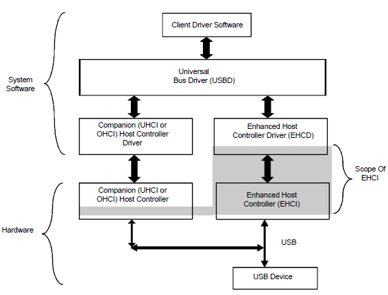

# 准备写USB驱动 #
---
[Part-1](USB驱动准备\(Part%201\).md)
[Part-2](USB驱动准备\(Part%202\).md)
[Part-3](USB驱动准备\(Part%203\).md)
<!--这里空一行，不要留标题-->
---

## <a name="task3">任务三：</a>解读EHCI手册 ##

前言
--

&ensp;
尽管任务二并未完成，但是一个新的发现，驱使我直接启动了任务三。
这个发现就是：我终于找到了**《EHCI说明手册》**！
发现的过程嘛……
就是我在百度、Github、Wikipedia上死活找不到关于EHCI的知识了。
就终于翻墙试了试Google，搜索下“EHCI protocol”，结果这篇文档直接排到了Rank 1。
哇塞！总算找到你了！Google就是好！

[《EHCI说明手册》](usb/ehci-specification-for-usb.pdf)

解读
--

USB通信中，设备分为Host和Client，如图为USB Host的架构：

看右侧路线，从上层到底层依次为：系统软件（客户端驱动-USB总线驱动-EHCI驱动）-硬件（EHCI控制器-USB设备）

而我们要实现的部分，就是自底向上的完成系统软件部分，即：先写EHCI驱动，（然后USB总线驱动就算了，）和USB键盘的客户端驱动

这里我分析的EHCI控制器的内容都是解读EHCI控制器驱动时需要的信息，这里需要注意以下内容：

1. EHCI的中一些关键的寄存器的意义，因为所有驱动代码里都只有寄存器名，不会再说明寄存器的每个位有什么作用，在读代码时会产生很大的理解障碍
2. EHCI的每个寄存器都有一个原文档中的表格，这里只给出了寄存器在原文档的页号，不会完整给出表格内容
3. EHCI的协议栈的工作原理

EHCI寄存器
--

EHCI的控制寄存器有PCI配置寄存器和内存映射USB主机控制器寄存器

PCI，Peripheral Component Interconnect(外设部件互连标准)，可不考虑相关内容

- 需要交代的一点是，PCI寄存器中有个寄存器的作用是配置内存映射寄存器的base地址，但对于不提供PCI接口的EHCI控制器（比如树莓派上的），不适用这种规则

内存映射寄存器，共两部分：

用语描述：

- RO 只读（特定bit只能读取，如果写入，将吴晓华）
- WO 只写（特定bit只能写入，如果读取，永远会读入0）
- R/W 可读且可写（特定bit可读，也可写）
- R/WC 可读且写入清零（特定bit可读，也可写，而写入1时必然会把某些相关bit清零）

- Host Controller Capability Registers
	- 只读，描述EHCI控制器的限制、约束和能力
	- CAPLENGTH: Offset 00h, Size 8bits=1byte
		- Capability Registers Length
		- 描述CAP段的长度，单位字节
		- REG\_BASE+CAP\_LENGTH就是Operational Register Space的起始地址
	- HCIVERSION: Offset 02h, Size 16bits=2bytes
		- Host Controller Interface Version Number
		- 描述EHCI的版本号，高字节是主版本号，低字节是次版本号
	- HCSPARAMS: Offset 04h, Size 32bits=4bytes
		- Structural Parameters
		- 描述了控制器结构的参数，如下游端口数等
		- **N\_PORTS**[3:0] 
			- 说明这个控制器实现了几个下游端口
		- Page 24~25
	- HCCPARAMS: Offset 08h, Size 32bits=4bytes
		- Capability Parameters
		- 多模式控制，寻址能力
		- Page 25~26
	- HCSP-PORTROUTE: Offset 0Ch, Size 60bits(没错，就是60比特)=7.5bytes
		- Companion Port Route Description
		- 一个(4bit)*[15]的数组，只有前N\_PORT个元素有意义
		- Page 26
- Operational Register Space
	- 读写，定义了可操作的寄存器
	- USBCMD: Offset 00h, Size 32bits=4bytes
		- USB Command Register
		- 说明总线主机控制器要执行的指令，每次写入该寄存器会导致执行一个指令
		- RO, R/W, WO，默认值为00080000h
		- Page 28~30
	- USBSTS: Offset 04h, Size 32bits=4bytes
		- USB Status Register
		- 该寄存器表示未处理的中断和控制器的多种状态
		- RO, R/W, R/WC，默认值为00001000h
		- Page 31~32
	- USBINTR: Offset 08h, Size 32bits=4bytes
		- USB Interrupt Enable Register
		- 控制USB的中断是否报告给软件的使能，如果关掉使能，中断状态仍会在USBSTS中保留
		- 中断使能的原理说明：在USBSTS中出现异步中断时，如果该寄存器设置了异步中断使能，USB控制器就会发出中断，清理 USBSTS内的中断位表示受理了该中断
		- R/W，默认值为00000000h
		- Page 32~33
	- FRINDEX: Offset 0Ch, Size 32bits=4bytes
		- Frame Index Register
		- 用来索引周期性帧列表，该寄存器没125ms更新一次，用bit[N:3]来索引周期性帧列表中的特定项，N取决于USBCMD中设置的表的具体大小
		- R/W（必须以DWord方式写入），默认值为00000000h
		- Page 33~34
		- 附加说明：
			1. 该寄存器必须被作为DWord写入，不能进行byte写入
			2. 除非USBSTS的HCHalted位表示控制器已经处于终止状态，否则不能进行写入
			3. 当USBCMD的Run/Stop位被置为1(Run)时，不能写入（RS位在HCHalted为终止状态时才能置1，此规则表示程序对FRINDEX的写入要在设置Run/Stop为Run之前完成）
			4. 对该寄存器的写入还会影响SOF寄存器的值（具体看SOF一章，里面提到SOF和FRINDEX有互动）
	- CTRLDSSEGMENT: Offset 10h, Size 32bits=4bytes
		- Control Data Structure Segment Register
		- 如果HCCPARAMS寄存器中设置了地址用64位表示，则该寄存器用来规定EHCI的所有数据结构的高32位地址，否则该寄存器无用，不可写入，且读入结果为0
		- R/W（必须以DWord方式写入），默认值为00000000h
		- Page 34
	- PERIODICLISTBASE: Offset 14h, Size 32bits=4bytes
		- Periodic Frame List Base Address Register
		- 包含周期性帧列表在内存里的起始地址，如果启用了64位地址，看CTRLDSSEGMENT，地址要求按4KB对齐（物理地址），寄存器的内容要与FRINDEX寄存器结合起来使控制器逐步访问整个列表
		- R/W（必须以DWord方式写入），默认值未定义
		- Page 34~35
	- ASYNCLISTADDR: Offset 18h, Size 32bits=4bytes
		- Current Asynchronous List Address Register
		- 包含要执行的下一个异步队列的头部，地址按32B对齐，如果启用了64位地址，看CTRLDSSEGMENT
		- R/W（必须以DWord方式写入），默认值未定义
		- Page 35
	- （中间地址为保留地址）
	- CONFIGFLAG: Offset 40h, Size 32bits=4bytes
		- Configure Flag Register
		- 该寄存器在辅助电源中，他只在辅助电源被初始应用时或响应控制器的重置时被硬件重置
		- R/W，默认值为00000000h
		- Page 35
	- PORTSC: Offset 44h+(4*PortNO-1), Size 32bits=4bytes
		- Port Status and Control Register
		- 一个控制器必须实现一或多个端口寄存器，端口寄存器的数量在HCSPARAMs寄存器中
		- RO, R/W, R/WC，默认值为00002000h或00003000h（取决于w/PPC被置为1或0）
		- Page 36~40

数据结构
--

