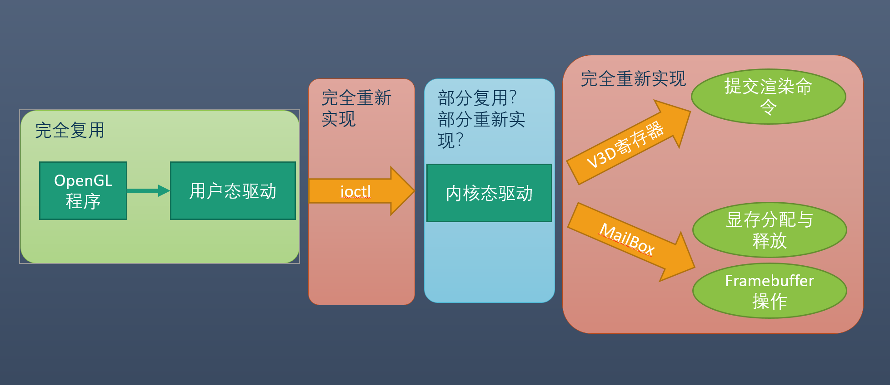

# Rust OS 上树莓派 USB 与 VideoCore IV 显卡驱动的移植

## 成员

- 第二小组
    - 贾越凯 2015011335
    - 寇明阳 2015011318
    - 孔彦 2015011349

## 实验目标

* 移植RustOS到Raspberry PI Model 3B+
* 完善 RustOS 功能
    * 完善系统调用
    * 完善文件系统
    * 完善用户程序库
* 驱动移植
    * VideoCore IV显卡驱动移植
    * USB驱动移植	

## 相关工作

* 2018年，《Rustable - ucore 在 arm 平台的 rust 移植》
    * 参考CS140e，实现了Raspberry PI Model 3上的rust版OS
    * 现已无法编译通过
* 2018年，《uCore plus 上 VideoCore IV 显卡驱动的移植与 OpenGL ES 的实现》
    * 基于uCore plus，实现了Raspberry PI zero上的VC4显卡驱动
    * 大量代码可直接复用
    * 芯片型号略有不同(BCM2835/BCM2837)
    * 2017年，《ucore+上USB驱动的移植(ARM平台)》
* 基于uCore plus，实现了ZYNQ 平台上的USB 驱动

## 实验方案

### 一、RustOS for arm

* 参考CS140e和Rustable项目的工作
    * 架构差异较大，直接复用困难
* 参考RustOS向RISCV32的移植
    * 如何向RustOS添加一种新的arch？
* 参考uCore plus向ARM的移植
    * 添加ARM架构需要对OS做哪些修改？

####  大致需要新增或修改的部分：
* Bootloader
* 内存管理
* 中断
* 进程上下文切换
* 串口、磁盘等驱动

### 二、完善RustOS功能

#### 完善文件系统
* 修复存在的bug
* 支持设备文件： open("fb0:")
* 支持对设备进行 ioctl 和 mmap 操作

#### 完善系统调用
* ioctl
* mmap
* munmap
* brk

#### 完善用户程序库
* 需要的功能：malloc、free
* 直接使用uCore plus的用户程序与库

### 三、移植VideoCore IV

### 四、让RustOS在树莓派3B+上支持USB设备

* 支持效果由实际工作进展决定
* 最低标准是实现USB键盘的支持
    * 从Linux中对USB键盘驱动代码和必要的依赖进行移植
    * USB键盘驱动位置：<linux>/drivers/hid/usbhid/usbkbd.c
* 拓展目标
    * 将Linux USB framework的核心完整的移植到RustOS中
    * 包括原框架中USB设备驱动程序的封装与注册机制、USB总线和设备的封装与注册机制
    * 还包括对USB控制器的支持，控制器依赖芯片的实现，在移植时要参照具体的芯片说明
* 在理解Linux USB framework时可能需要涉及的资料
    * 重点：Linux源代码
    * USB 2.0 specification (from www.usb.org)
        * 我扫了40页，都是接口规格和各种情况下的物理参数，没有软件协议
    * Chip specifications for USB controllers
        * (from www.raspberrypi.org/documentation/hardware/raspberrypi)
        * 扫了一遍，说明不多，没有提到软件协议
    * USB外围设备的协议说明
        * 不同设备的协议有供应商特制的和www.usb.org小组提出的范例
        * 读代码比较直接，但以后会适当看一下

## 小组分工

* 移植RustOS到Raspberry pi（共同完成）
* 完善 RustOS 功能
    * 完善系统调用（贾越凯）
    * 完善文件系统（寇明阳）
* 驱动移植
    * VC4驱动移植（贾越凯）
    * USB驱动移植（孔彦）

## 时间安排

* 移植RustOS到Raspberry pi（第4~5周）
* 完善 RustOS 功能（第4~6周）
    * 完善系统调用
    * 完善文件系统
* 驱动移植（第6周）
    * VC4驱动移植
    * USB驱动移植
* 测试、合并（第7~8周）
